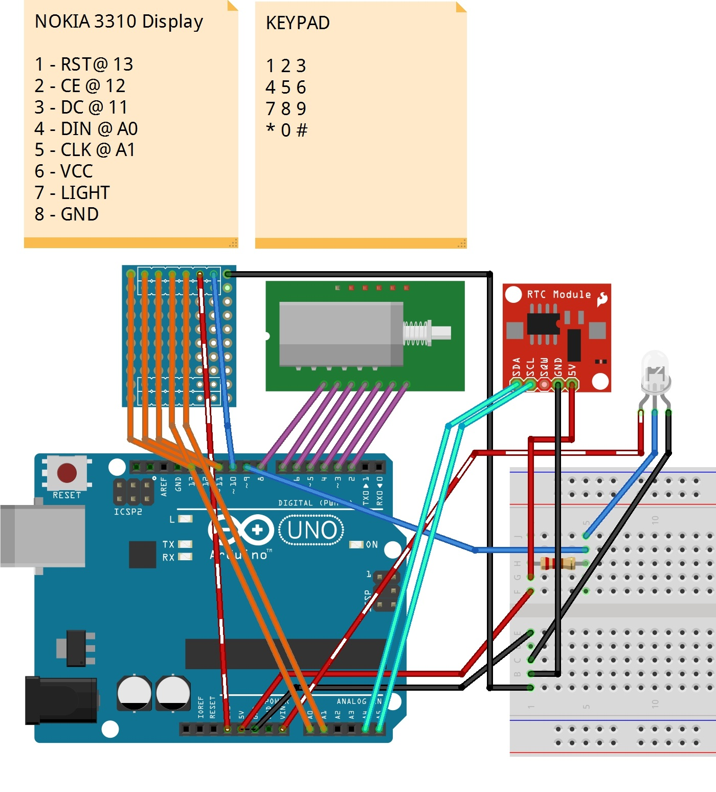
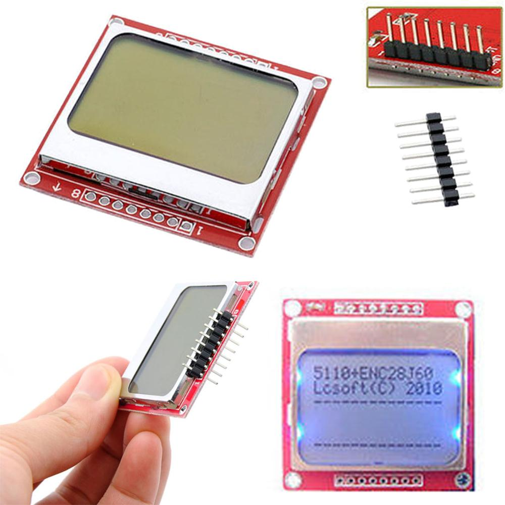
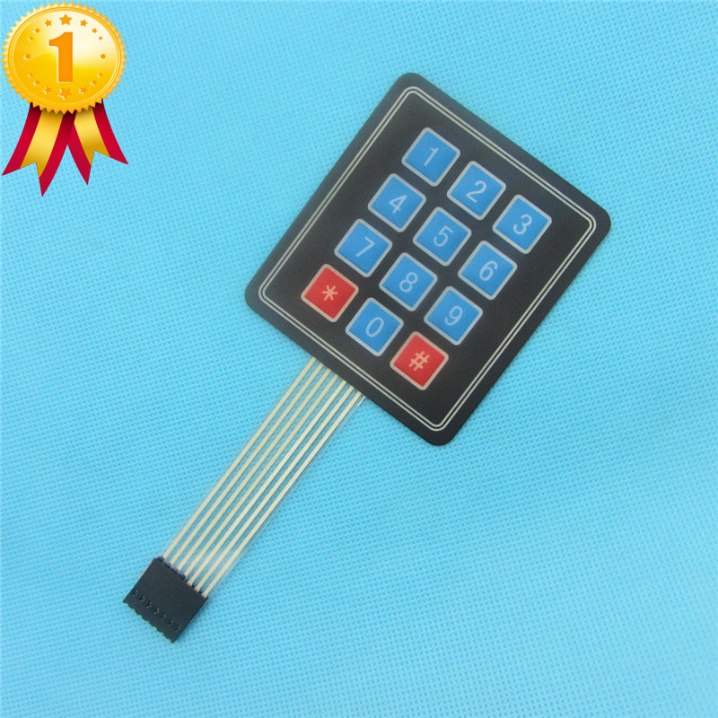
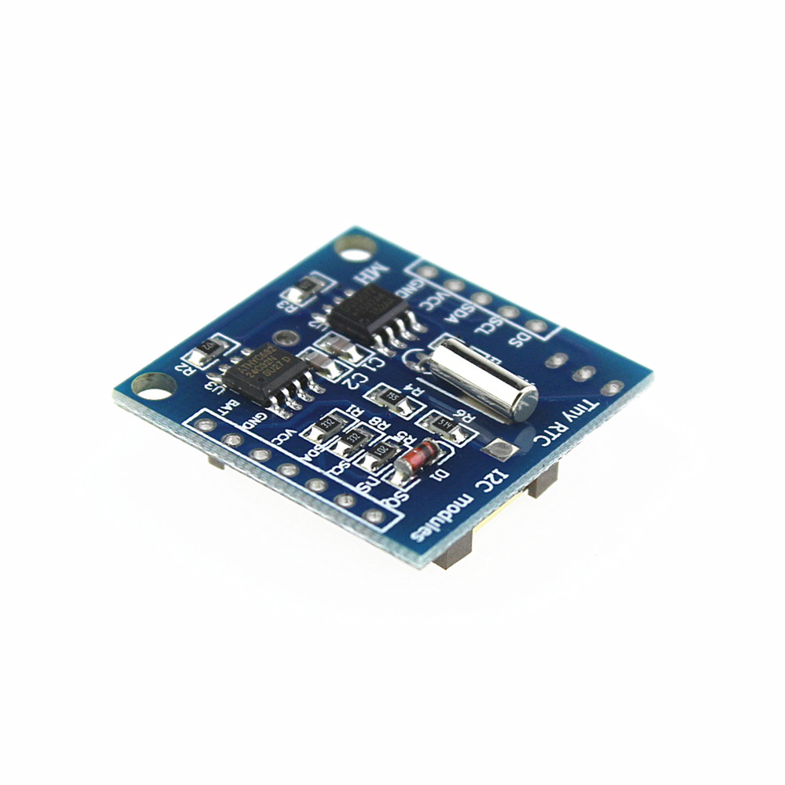
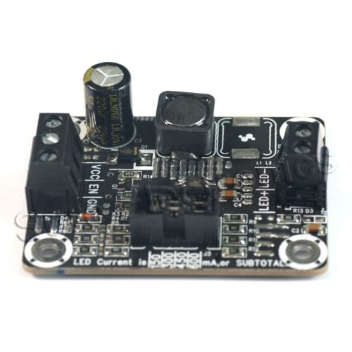
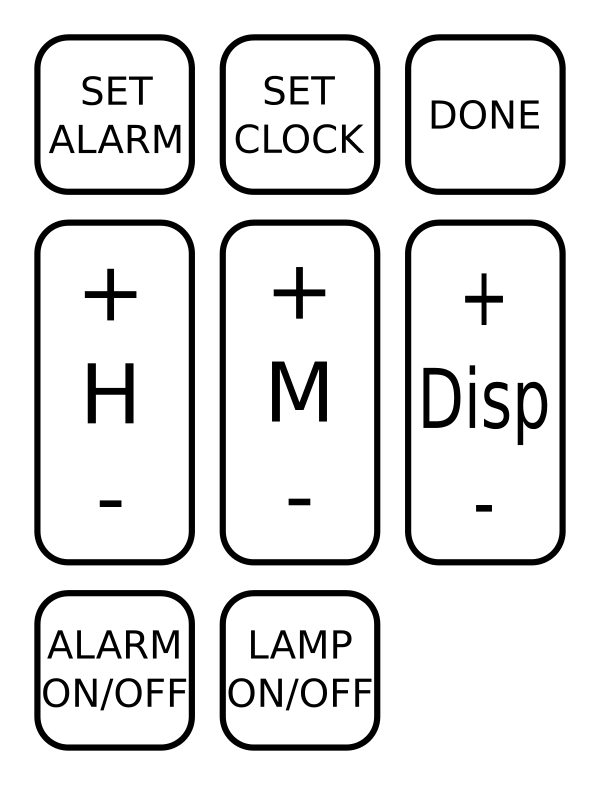

# Sunrise Alarm Clock

## Summary

When I lived in a dark bedroom with a very small window, I decided to create an alarm clock that simulated the sunrise. Electronics and  software from scratch. It made waking up much more pleasant!

## Features

- Track current time, even without power, using battery powered RTC (real-time clock).
- LED lamp slowly fades into full brightness at the set alarm time, using pulse-width modulation applied to a gamma curve (to match human perception of brightness)
- Remember important settings, such as display contrast level and alarm time, by storing in EEPROM.
- Can set current time using Hour and Minute buttons
- Can set alarm time using Hour and Minute buttons
- Can toggle LCD contrast level.
- Can toggle alarm on/off.
- Can toggle LED lamp on/off.
- LCD screen has backlight on timer to be readable in the dark.

## Components

- Arduino Uno
- **UI**
  - Nokia 5110 LCD Display  
  - 4x3 Keypad  
- **Timekeeping**
	- DS1307 TinyRTC  
- **LED**
	- 1500mA Buck Regulator LED Driver (supplies current to the LED and supports pulse-width modulation for dimming)  
	- ~10W LED Bulb (I recycled an LED bulb with a broken AC-DC power supply)

## Design

The resulting design looks roughly like this:

Nearly every available pin was required on the Arduino. Unfortunately I don't have a good picture of the device itself.

## Keypad

I created a mask for the 4x3 keypad, which gives a good idea of the features the Alarm Clock supports.

